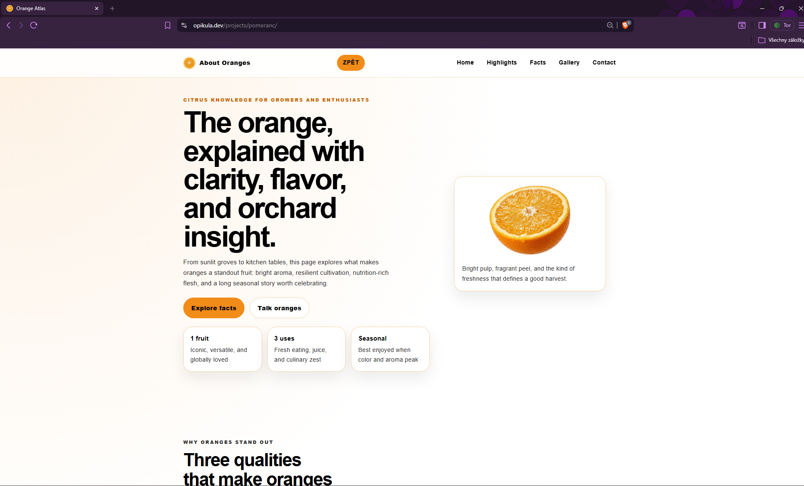
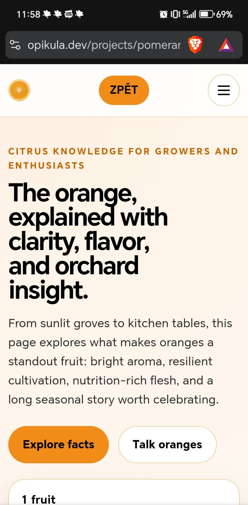
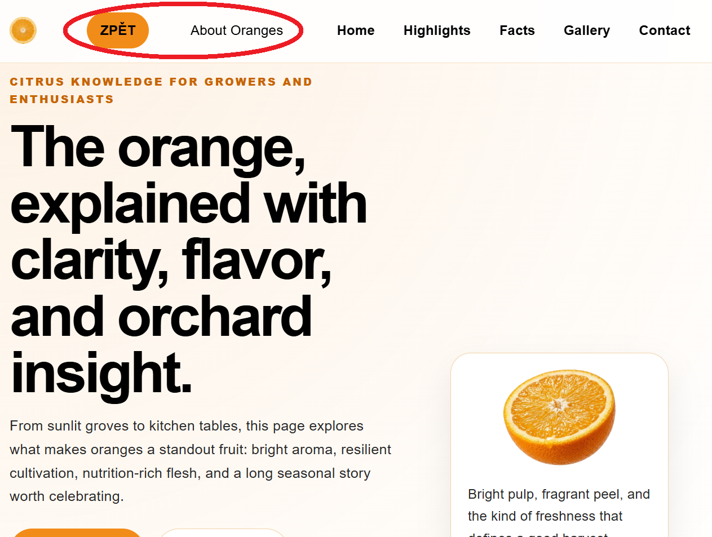
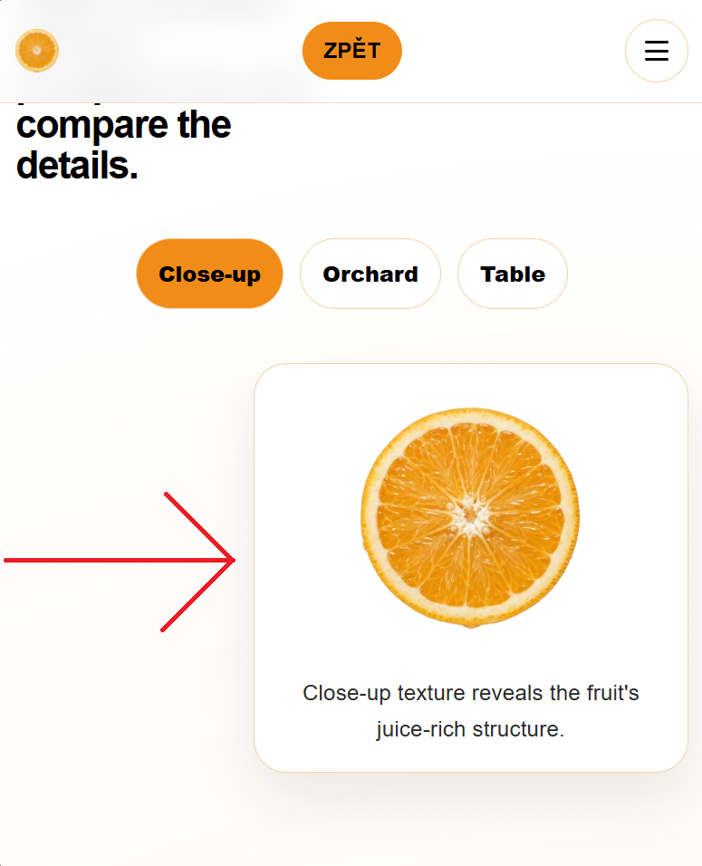
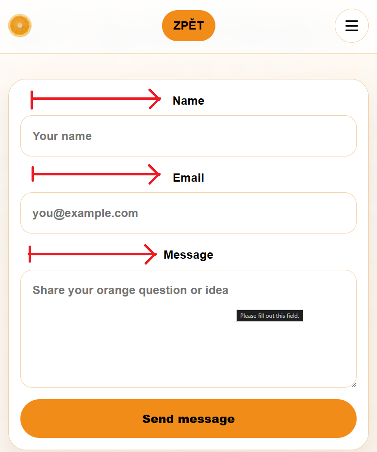
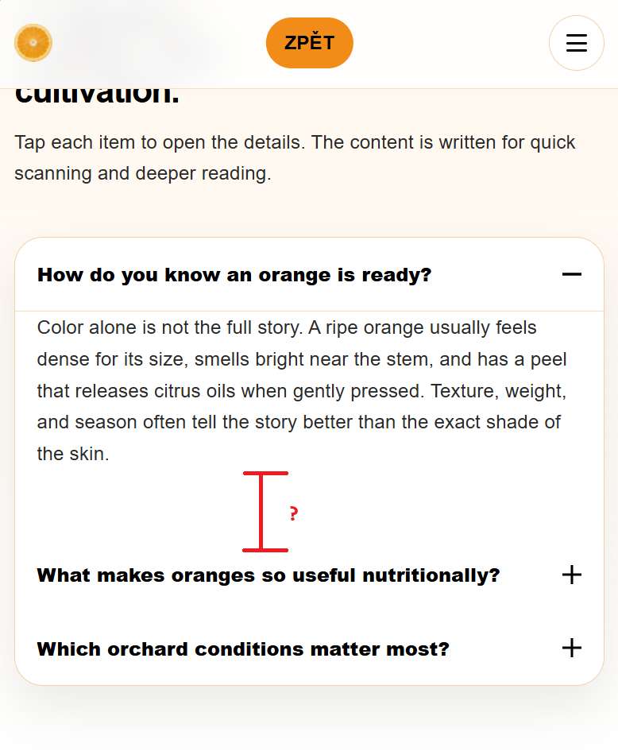

# Orange Project Documentation

## 1. Introduction

- Project name: Orange Atlas
- Topic: A single-page educational website about oranges (flavor, cultivation, nutrition, and gallery content)
- Live website: <a href="https://opikula.dev/projects/pomeranc/">https://opikula.dev/projects/pomeranc/</a>

## 2. Technologies Used

- HTML5
- CSS3
- JavaScript (vanilla)
- Browser used for development/testing: Brave
- IDE: Visual Studio Code (user setup)

## 3. Directory Structure

```text
website/
├── projects/
│   └── pomeranc/
│       ├── 1pomeranc.png    <- Gallery/content image 1
│       ├── 2pomeranc.png    <- Gallery/content image 2
│       ├── 3pomeranc.png    <- Gallery/content image 3
│       ├── 4pomeranc.png    <- Gallery/content image 4
│       ├── 5pomeranc.png    <- Gallery/content image 5
│       ├── 6pomeranc.png    <- Gallery/content image 6
│       ├── 7pomeranc.png    <- Gallery/content image 7
│       ├── index.html       <- Main page structure and semantic content
│       ├── pomeranc.ico     <- Project favicon
│       ├── README.md        <- This documentation file
│       ├── robots.txt       <- Search engine crawl instructions
│       ├── script.js        <- Interactive behavior (menu, accordion, tabs, reveal)
│       ├── sitemap.xml      <- URL map for search engines
│       ├── style.css        <- Project-specific styles and responsive layout
│       └── pngs/
│           ├── problem1.png <- Technical issue screenshot #1
│           ├── problem2.png <- Technical issue screenshot #2
│           ├── problem3.png <- Technical issue screenshot #3
│           ├── problem4.png <- Technical issue screenshot #4
│           ├── scr1.png     <- Desktop screenshot
│           └── scr2.png     <- Mobile screenshot
```

## 4. Technical Analysis (6 Optimization Areas)

### 4.1 Header Layout and Responsive Brand Text

Theory:
The brand text should stay readable on large screens, but it should not break the header layout on small screens. The solution is to keep it on one line and hide it below a breakpoint.

Code snippet:
```css
.brand-text {
	display: inline-block;
	white-space: nowrap;
	overflow: hidden;
	max-width: 12rem;
}

@media (max-width: 48rem) {
	.brand-text,
	.hide-mobile {
		display: none;
	}
}
```

Explanation:
This prevents wrapping/overflow and removes the text on narrow viewports, so the logo, menu button, and navigation keep a clean layout.

### 4.2 Mobile Navigation Behavior and ARIA State Sync

Theory:
A mobile menu should be easy to open/close, keyboard friendly, and accessible for screen readers.

Code snippet:
```js
const closeMenu = () => {
	siteNav.classList.remove('is-open');
	menuToggle.setAttribute('aria-expanded', 'false');
	menuToggle.setAttribute('aria-label', 'Open menu');
};

const openMenu = () => {
	siteNav.classList.add('is-open');
	menuToggle.setAttribute('aria-expanded', 'true');
	menuToggle.setAttribute('aria-label', 'Close menu');
};
```

Explanation:
The menu state is mirrored both visually (`is-open`) and semantically (`aria-expanded`, `aria-label`), improving accessibility and UX consistency.

### 4.3 Accordion Stability and Spacing Fix

Theory:
Accordion panels must open/close without leaving large blank spaces. Closed panels should not affect layout.

Code snippet:
```css
.accordion-panel {
	display: none;
	padding: 0 1.15rem 1.1rem;
}

.accordion-trigger[aria-expanded="true"] + .accordion-panel {
	display: block;
}

.accordion-panel p {
	margin-block-end: 0;
}
```

Explanation:
Closed panels are fully removed from layout (`display: none`), and the paragraph bottom margin is normalized, removing the unwanted gap.

### 4.4 Gallery Centering and Tab Visibility Control

Theory:
Tabbed gallery content must stay horizontally centered and only show one panel at a time.

Code snippet:
```css
.gallery-shell > .gallery-controls,
.gallery-shell > .gallery-panels {
	grid-column: 1 / -1;
}

.gallery-panel[hidden] {
	display: none;
}
```

```js
galleryPanels.forEach((panel) => {
	const isTarget = panel.dataset.galleryPanel === target;
	panel.classList.toggle('is-active', isTarget);
	panel.hidden = !isTarget;
});
```

Explanation:
Grid spanning centers the gallery block across layout columns, while `hidden` keeps inactive panels out of view and out of layout.

### 4.5 Semantic HTML and Accessibility Mapping

Theory:
Interactive components should use semantic roles, labels, and control relationships for accessibility tools.

Code snippet:
```html
<button class="gallery-tab" type="button" role="tab" aria-selected="false"
	aria-controls="gallery-panel-orchard" id="gallery-tab-orchard"
	data-gallery-target="orchard">Orchard</button>

<figure class="gallery-panel" data-gallery-panel="orchard"
	id="gallery-panel-orchard" role="tabpanel"
	aria-labelledby="gallery-tab-orchard" hidden>
```

Explanation:
`role`, `aria-controls`, and `aria-labelledby` connect tabs to panels, making navigation understandable for assistive technologies.

### 4.6 Performance and SEO Readiness

Theory:
Performance and discoverability improve with lazy loading, reduced-motion support, and crawler metadata files.

Code snippet:
```html

```

```css
@media (prefers-reduced-motion: reduce) {
	*, *::before, *::after {
		animation-duration: 0.01ms !important;
		transition-duration: 0.01ms !important;
	}
}
```

Explanation:
Images below the fold load on demand, animations are minimized for motion-sensitive users, and `robots.txt` + `sitemap.xml` support search indexing.

## 5. AI Log

### Prompt 1: Full page generation prompt
- Purpose: Generate a complete one-page Orange website with HTML, CSS, and JavaScript files.
- AI contribution: Built the initial structure, design system, and core interactions (menu, accordion, tabs, reveal animation).

### Prompt 2: Header and alignment fixes
- Purpose: Fix header text placement and responsive behavior.
- AI contribution: Suggested breakpoint-based text hiding and layout-safe header rules.

### Prompt 3: Accordion spacing issue
- Purpose: Remove unexpected empty space when accordion panels are opened/closed.
- AI contribution: Identified panel display/margin conflict and proposed a stable CSS/JS solution.

### Prompt 4: Gallery centering and panel switching
- Purpose: Center gallery controls/content and keep tab switching functional.
- AI contribution: Added grid-column spanning and explicit `[hidden]` handling for reliable visibility toggling.

## 6. Installation and Local Run

If you want to clone the full repository, use:

```bash
git clone https://github.com/OpiKula2877/website
cd website
```

To run locally:

1. Open the project in Visual Studio Code.
2. Open `projects/pomeranc/index.html`.
3. Run with a local static server, for example:
	 - Live Server extension
	 - Live Preview extension

## 7. Gallery

### Desktop


### Mobile


### Key Feature/Debug Screens




